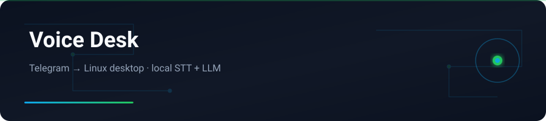

<div align="center">



</div>

# Voice Desk

**Speak. Type. Command.** A private Telegram bridge to your Linux desktop — local speech recognition and a local LLM.

---

## English


### Features

- Telegram text, voice notes, and shortcuts
- Faster-Whisper local STT + Ollama command planning
- Shell execution with timeout, danger heuristics, confirmation gates
- Command output + desktop screenshots
- Allowlisted Telegram user access

### Stack

Python 3.11+ · Telegram Bot API · Ollama · Faster-Whisper · Linux Wayland/X11

### Getting started

```bash
git clone https://github.com/yasinfallahati/voice-desk.git
cd voice-desk
python -m venv .venv && source .venv/bin/activate
pip install -r requirements.txt   # if present
# configure bot token + allowlist in bot/config
python -m bot.main
```


## License

MIT — see `LICENSE` if present.

---

## فارسی

### ویس دسک

پل خصوصی تلگرام به دسکتاپ لینوکس — تشخیص گفتار و LLM محلی.


### امکانات

- متن، ویس و شورتکات تلگرام
- Faster-Whisper محلی + برنامه‌ریزی دستور با Ollama
- اجرای شل با تایم‌اوت، تشخیص خطر و تأیید
- خروجی دستور + اسکرین‌شات دسکتاپ
- دسترسی محدود به آیدی تلگرام مجاز

### تکنولوژی‌ها

Python 3.11+ · Telegram Bot API · Ollama · Faster-Whisper · Linux Wayland/X11

### شروع کار

```bash
git clone https://github.com/yasinfallahati/voice-desk.git
cd voice-desk
python -m venv .venv && source .venv/bin/activate
pip install -r requirements.txt
# توکن ربات و allowlist را در تنظیمات پر کنید
python -m bot.main
```

---

`#python` `#telegram-bot` `#whisper` `#ollama` `#linux` `#automation` `#voice` `#local-ai`
