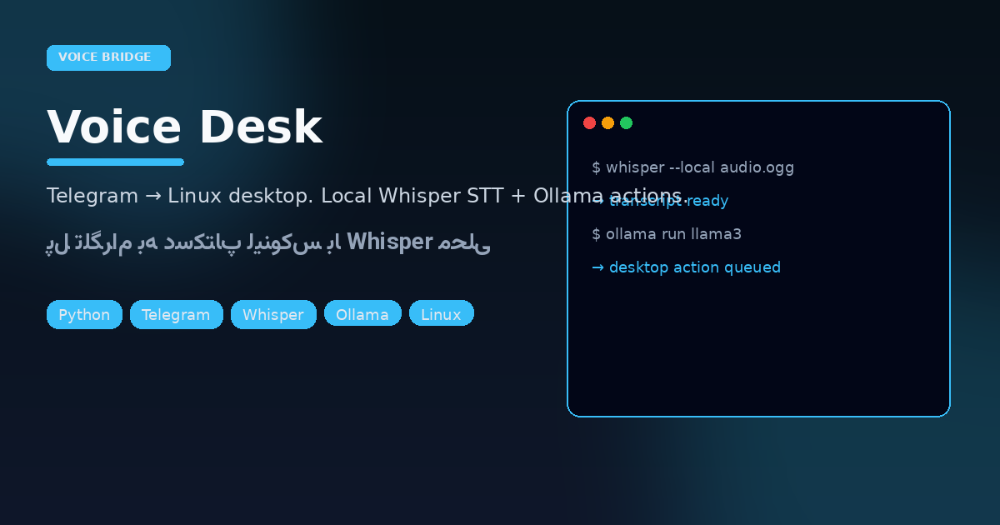

# Voice Desk
> Speak into Telegram. Your Linux box listens — locally.

<p align="center"></p>

<p align="center">


</p>

<p align="center">

</p>

Private bridge: allowlisted Telegram users send voice/text → **faster-whisper** STT on-box → **Ollama** plans/actions → desktop shortcuts from `shortcuts.yaml` (screenshots, commands, menus).

## Bring-up

```bash
python3 -m venv .venv && .venv/bin/pip install -r requirements.txt
cp .env.example .env   # bot token + allowlist
./run.sh
```

Tune `bot/config.py`, `shortcuts.yaml`, and proxy env if Telegram needs SOCKS (`socks://` auto-rewritten to `socks5://`).

---

## فارسی — ویس‌دسک

پل خصوصی از **تلگرام به دسکتاپ لینوکس**: ویس با Whisper محلی رونویسی می‌شود، Ollama تصمیم/پاسخ می‌سازد، و شورتکات‌های YAML روی میزکار اجرا می‌شوند. فقط کاربران allowlist.

### راه‌اندازی

```bash
python3 -m venv .venv && .venv/bin/pip install -r requirements.txt
cp .env.example .env   # توکن ربات و لیست مجاز
./run.sh
```

### چرا محلی؟

| ریسک کلود | پاسخ Voice Desk |
|-----------|------------------|
| ارسال ویس به سرویس خارجی | Whisper روی همان ماشین |
| اجرای کور دستورات | شورتکات‌های محدود + منو |
| دسترسی همگانی به ربات | allowlist سخت |

مناسب کسی که می‌خواهد از موبایل به لینوکس خانه/اداره فرمان بدهد بدون باز کردن RDP عمومی.
