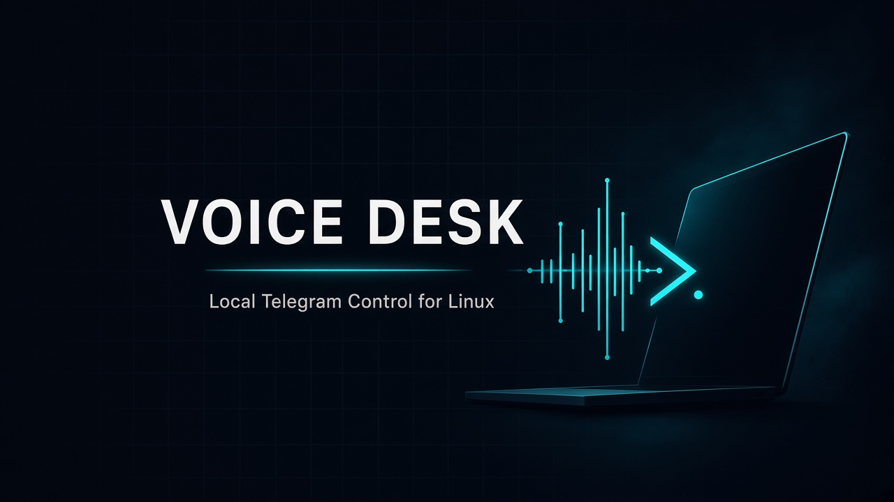
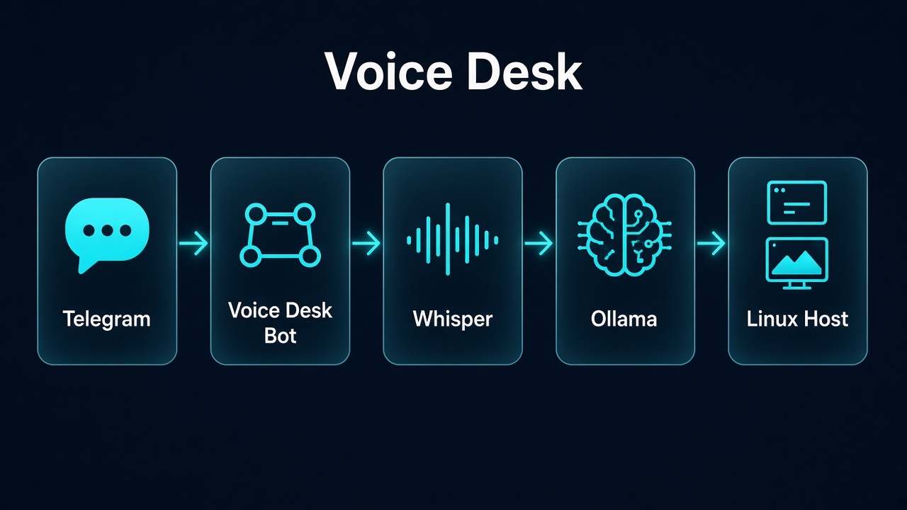
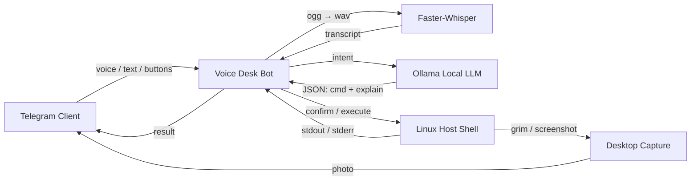

<p align="center">
  
</p>

<h1 align="center">Voice Desk</h1>

<p align="center">
  <strong>Speak. Type. Command.</strong><br/>
  A private Telegram bridge to your Linux desktop — powered by local speech recognition and a local LLM.
</p>

<p align="center">
  <a href="#features"></a>
  <a href="#architecture"></a>
  <a href="#security"></a>
  <a href="LICENSE"></a>
</p>

<p align="center">
  
  
  
  
  
</p>

---

## Why Voice Desk?

Most “remote control” bots either send everything to the cloud or give you a blunt shell with no safety rails.  
**Voice Desk** is built for a different job: keep inference on your machine, keep access locked to your Telegram ID, and turn natural language (voice or text) into deliberate, reviewable system actions.

| Layer | What happens |
|------|----------------|
| **Input** | Telegram text, voice notes, or one-tap shortcuts |
| **Understanding** | Faster-Whisper (local STT) + Ollama (local command planning) |
| **Action** | Shell execution with timeout, danger heuristics, and confirmation gates |
| **Feedback** | Command output + desktop screenshots + optional live screen refresh |

---

## Features

### Control surface
- **Persistent reply keyboard** for everyday actions (screenshot, live view, Chrome, Cursor, VPN, lock, shutdown…)
- **YAML shortcuts** for reusable shell recipes
- **Free-form text & voice** routed through your local model
- **Direct shell** via `/run` when you already know the command

### Local AI stack
- **Whisper** for Persian/English speech-to-text (no cloud STT required)
- **Ollama** (`qwen2.5`, `llama3.2`, …) to translate intent → a single shell command
- **Confirm-before-run** for model-generated commands (recommended default)

### Remote visibility
- One-shot **screenshots** (`/shot`)
- **Live screen** updates every few seconds (`📺 Live` / `/live`)
- Results returned as Telegram messages + photos

### Guardrails
- Telegram **user allowlist**
- Dangerous-pattern detection (`rm -rf /`, disk wipe, reboot, …)
- Explicit confirmation for destructive actions
- Secrets stay in `.env` (never committed)

---

## Architecture

<p align="center">
  
</p>



Everything sensitive stays on the host: speech models, LLM weights, shell privileges, and screenshots.

---

## Quick start

### 1) Prerequisites

```bash
# System tools
sudo apt install -y ffmpeg grim   # grim = Wayland screenshots

# Local LLM (example)
ollama pull qwen2.5:7b
```

Also create a Telegram bot with [@BotFather](https://t.me/BotFather) and copy your numeric user ID from [@userinfobot](https://t.me/userinfobot).

### 2) Install

```bash
git clone https://github.com/yasinfallahati/voice-desk.git
cd voice-desk

python3 -m venv .venv
source .venv/bin/activate
pip install -r requirements.txt

cp .env.example .env
# Edit .env → TELEGRAM_BOT_TOKEN + ALLOWED_USER_IDS
```

### 3) Run

```bash
chmod +x run.sh
./run.sh
```

Open Telegram → send `/start` → use the keyboard.

> First voice message downloads the Whisper model (`base` by default). Subsequent requests are faster.

---

## Configuration

| Variable | Purpose | Default |
|----------|---------|---------|
| `TELEGRAM_BOT_TOKEN` | Bot token from BotFather | — |
| `ALLOWED_USER_IDS` | Comma-separated Telegram user IDs | — |
| `OLLAMA_BASE_URL` | Local Ollama endpoint | `http://127.0.0.1:11434` |
| `OLLAMA_MODEL` | Command-planning model | `qwen2.5:7b` |
| `WHISPER_MODEL` | STT model size | `base` |
| `WHISPER_LANGUAGE` | STT language hint | `fa` |
| `COMMAND_TIMEOUT` | Max shell runtime (seconds) | `60` |
| `AUTO_EXECUTE_LLM` | Skip confirm for LLM commands | `false` |
| `TEMP_DIR` | Working directory for media | `/tmp/conect-bot` |

Shortcuts live in [`shortcuts.yaml`](./shortcuts.yaml). Keyboard actions live in [`bot/menu.py`](./bot/menu.py).

---

## Telegram UX

| Action | How |
|--------|-----|
| Open menu | `/start` or `/menu` |
| Screenshot | `📸 Screenshot` / `/shot` |
| Live desktop | `📺 Live` / `/live` → stop with `⏹ Stop live` |
| Voice → command | Send a voice note |
| Text → command | Send natural language |
| Named shortcut | Type shortcut name or `/s <name>` |
| Raw shell | `/run <command>` (always confirms) |
| List shortcuts | `/shortcuts` |

**Chrome search flow:** tap `🔎 Chrome search` → bot asks what to search → opens Google Chrome with your query.

---

## Security model

Voice Desk is a **personal operator**, not a multi-tenant SaaS.

1. **Identity gate** — only IDs in `ALLOWED_USER_IDS` get replies  
2. **Confirmation gate** — LLM-planned commands require explicit approve/cancel  
3. **Heuristic gate** — high-risk patterns always force confirmation  
4. **Process boundary** — the bot runs as your Linux user; treat the token like a password  

> Do not enable `AUTO_EXECUTE_LLM=true` unless you accept that every correctly-transcribed voice command can mutate your machine.

---

## Project layout

```text
voice-desk/
├── bot/
│   ├── main.py          # entrypoint + Telegram wiring
│   ├── handlers.py      # commands, voice/text, live view
│   ├── menu.py          # reply keyboard & button actions
│   ├── llm.py           # Ollama command planner
│   ├── stt.py           # Whisper transcription
│   ├── executor.py      # shell runner + danger checks
│   ├── screenshot.py    # Wayland/X11 capture helpers
│   └── shortcuts.py     # YAML shortcut store
├── docs/assets/         # README visuals
├── shortcuts.yaml       # predefined recipes
├── .env.example         # configuration template
├── requirements.txt
└── run.sh               # bootstrap + launch
```

---

## Optional: run as a user service

```bash
mkdir -p ~/.config/systemd/user
cat > ~/.config/systemd/user/voice-desk.service <<'EOF'
[Unit]
Description=Voice Desk Telegram Linux Bot
After=network-online.target

[Service]
WorkingDirectory=%h/path/to/voice-desk
ExecStart=%h/path/to/voice-desk/run.sh
Restart=on-failure
RestartSec=5

[Install]
WantedBy=default.target
EOF

systemctl --user daemon-reload
systemctl --user enable --now voice-desk.service
```

---

## Roadmap ideas

- [ ] Named search engines / custom Chrome start URLs per button  
- [ ] Optional JPEG compression + adaptive live-view interval  
- [ ] Audit log of approved commands  
- [ ] Pairing flow for adding allowlisted users without editing `.env`  

---

## License

MIT — use it, fork it, harden it for your own desk.

---

<p align="center">
  <sub>Built for Linux operators who want Telegram convenience without giving up local control.</sub>
</p>
